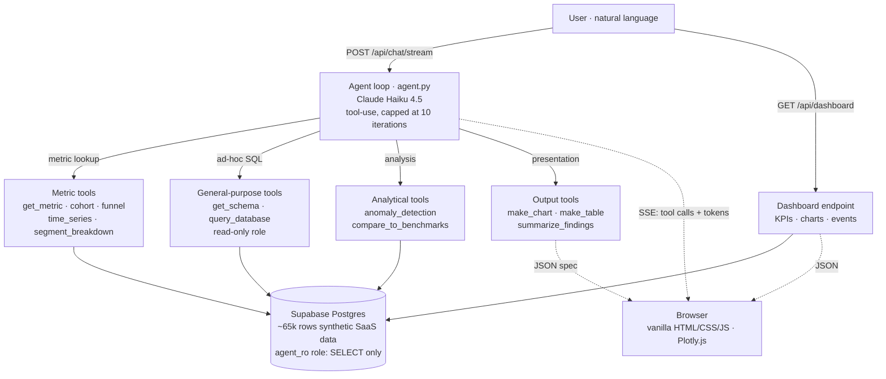

# Growth Analytics Agent

A single-page web app that combines a fixed dashboard of SaaS growth metrics with an agentic chat that answers plain-English questions about the data.

**Live demo:** [growth-analytics-agent.vercel.app](https://growth-analytics-agent.vercel.app/) (synthetic data; not a real company).

## What it does

The page has two halves:

1. **Fixed dashboard** at the top: 5 KPI cards (MRR, ARR, MoM growth, gross churn, LTV/CAC), an MRR-over-time line chart, a cohort retention heatmap, and an annotated events timeline. All data loaded once via `GET /api/dashboard`.
2. **Chat agent** below: ask plain-English questions ("which channel has the worst CAC?", "did anything unusual happen in March?"). The agent autonomously decides which tools to call against a Supabase Postgres database, runs analyses (cohort, funnel, segment breakdown, time-series compare, anomaly detection, industry benchmark lookup), and streams the answer back token by token. Charts and tables render inline.

The agent is a real tool-use loop, not a RAG chatbot. It maintains in-session memory so follow-up questions work ("is that healthy?" after asking about LTV/CAC).

## Tech stack

| Layer | Choice | Why |
|---|---|---|
| Runtime | Python 3.12 (via `uv`) | Modern dependency management with reproducible lockfiles. |
| LLM | Claude Haiku 4.5 | Cheap enough for portfolio traffic; strong tool-use. |
| Database | Supabase (Postgres + pgvector) | Free tier, dashboard for browsing, hosted Postgres. |
| Backend | FastAPI on Vercel Functions | Stateless serverless, free hosting, simple deploy. |
| Frontend | Vanilla HTML/CSS/JS + Plotly.js | No framework. Renders Plotly JSON specs from the agent. |
| Streaming | Server-Sent Events (SSE) | Standard for token-by-token streaming. |
| Lint + format | `ruff` | Industry standard for Python. |
| Tests | `pytest` (14 tests, CI on every push) | Catches regressions in SQL tool and rollup math. |
| CI | GitHub Actions | Runs `ruff` + `pytest` on every push and PR. |

Deliberately not used: LangChain, LlamaIndex, agent frameworks, React, TypeScript. The agent loop was built from the Anthropic SDK directly, so every piece of behavior is visible and tunable.

## Architecture



## Repo layout

```
growth-ai-agent/
├── agent.py                 Tool-use loop. CLI mode + run_agent / run_agent_streaming.
├── api/
│   └── index.py             FastAPI app. /api/dashboard, /api/chat, /api/chat/stream, /api/ping.
├── db/
│   └── schema.sql           Postgres schema for the 11 data tables + rate_limits.
├── lib/
│   ├── dashboard.py         Builds the fixed dashboard payload.
│   ├── logging.py           Structured JSON logging (one event per line).
│   ├── rate_limit.py        Per-IP rate limit backed by Postgres.
│   └── render.py            Dev helper: save chart spec as standalone HTML.
├── public/
│   ├── index.html, app.js, style.css
├── scripts/
│   ├── generate_data.py     Reproducible synthetic data generator.
│   └── load_data.py         Loads CSVs into Supabase via COPY.
├── tests/
│   ├── test_sql.py          Contract tests for the SQL tool.
│   └── test_rollups.py      Consistency checks on the data + metric tools.
├── tools/                   Importable agent tools (one tool per file).
│   ├── schema.py, sql.py, metrics.py, cohort.py, funnel.py,
│   ├── time_series.py, segment.py, anomaly.py, benchmarks.py, output.py
│   └── _db.py               Shared read-only Postgres connection helper.
├── .github/workflows/ci.yml CI: ruff check + pytest on every push.
└── pyproject.toml, uv.lock
```

## Local setup

Prerequisites: `uv` (Python package manager) and a Supabase project.

```bash
# Clone and install deps
git clone https://github.com/lucaslimaa2/growth-analytics-agent.git
cd growth-analytics-agent
uv sync

# Create a .env at the repo root with:
#   SUPABASE_DB_URL_POOLED=<transaction pooler URL, postgres role>
#   SUPABASE_DB_URL_READONLY=<transaction pooler URL, agent_ro role>
#   ANTHROPIC_API_KEY=<your key from console.anthropic.com>

# Generate + load synthetic data (one-time, takes ~60s)
uv run python scripts/generate_data.py
uv run python scripts/load_data.py

# Run the chat locally
uv run uvicorn api.index:app --host 127.0.0.1 --port 8000
# open http://127.0.0.1:8000/

# Or CLI mode (faster for iterating on tool behavior)
uv run python agent.py "What is our current MRR?"

# Run the tests
uv run pytest
```

## Key design decisions

1. **Read-only DB role for the agent.** The `agent_ro` Postgres role has SELECT permissions only. Bad SQL generated by Claude cannot write or drop. Defense in depth instead of trusting the prompt.
2. **Hard cap of 10 tool calls per question.** Prevents runaway agent loops and bounds the worst-case cost per request.
3. **500-row cap on `query_database`.** Token-efficient; the agent learns to aggregate rather than dump raw rows. Matches the industry pattern used by Hex, Mode AI, Cube.dev.
4. **Pre-built metric tools (Tier 2).** Cohort, funnel, segment breakdown, and time-series compare are Python functions, not SQL the agent writes from scratch. Guarantees the math is consistent across questions, faster than re-deriving each time, and locks the formula for metrics where definition matters (LTV, ARPU, net churn).
5. **In-memory conversation history (no persistence in v1).** Memory survives the browser tab; refresh resets it. Simpler than persisting and lets the agent answer follow-up questions in the same session.
6. **Plotly JSON specs over PNG images.** Charts render interactively (hover, zoom) in the browser. The agent emits a structured spec via `make_chart`; the frontend hands it to Plotly.js.
7. **Schema in system prompt plus `get_schema()` as a tool.** The agent gets table descriptions and semantic context. Each column also has a hand-written description for ambiguous fields (e.g., what `end_reason='price_increase_migration'` means).
8. **Streaming via SSE for tool calls and text tokens.** Users see what the agent is doing as it happens (tool pills, progressive text) instead of waiting for the full response.
9. **Synthetic data with planted patterns.** A reproducible generator (`seed=42`) produces 24 months of SaaS data with 5 planted business moments (CAC spike at m7, Pro plan price hike at m12, referral program launch at m16, activation feature ship at m19, day-long outage at m22-day-14). The agent should find these unprompted; the dataset also serves as a regression test of the agent's reasoning.

## Cost and rate limiting

Every answer in the chat shows its cost in the footer (e.g., `2 iterations, 0.85¢`). Typical questions cost under a cent on Haiku 4.5. The same `cost_usd` value is logged structurally per question.

A per-IP rate limit (10 requests per 60 seconds, backed by a Postgres table) prevents abuse. Hitting it returns HTTP 429 with a `Retry-After` header.

Prompt caching is enabled with a 1-hour TTL on the system prompt and tool catalog. Caching activates once the prefix exceeds Haiku's 4,096-token minimum, which happens for any conversation with prior turns in context.

## Disclaimer

This project uses synthetic data generated by a deterministic Python script. No real customer information is involved. Any insights the agent surfaces (CAC, churn, LTV) reflect the synthetic dataset and have no correspondence to any real company.
